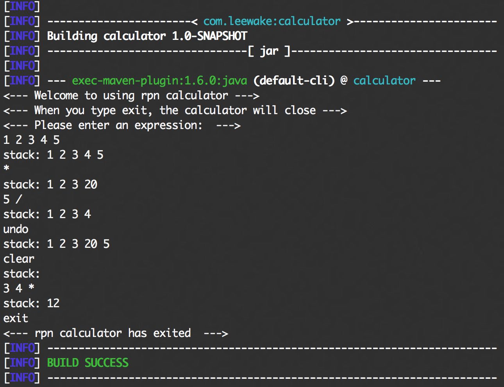
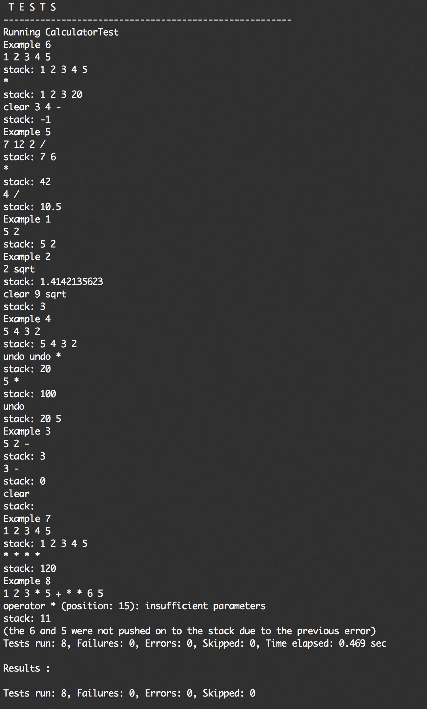

# RPN Calculator

# Description

- operator: related to operator
- rpn: core calculator logic 
- AuxiliaryUtil: util for printing and writing logs
- Main: the entrance of the whole program 

# Run

- You can run named depoly.sh script and type some expression,
then you will get corresponding result.
For example :

```
mvn test -Dtest=CalculatorTest#exampleOneTest  
```

# Test

- You can run named test.sh script, then get a test report. For example :

- You also can run some test case, using the following command：
```
mvn test -Dtest=CalculatorTest#exampleOneTest  
```